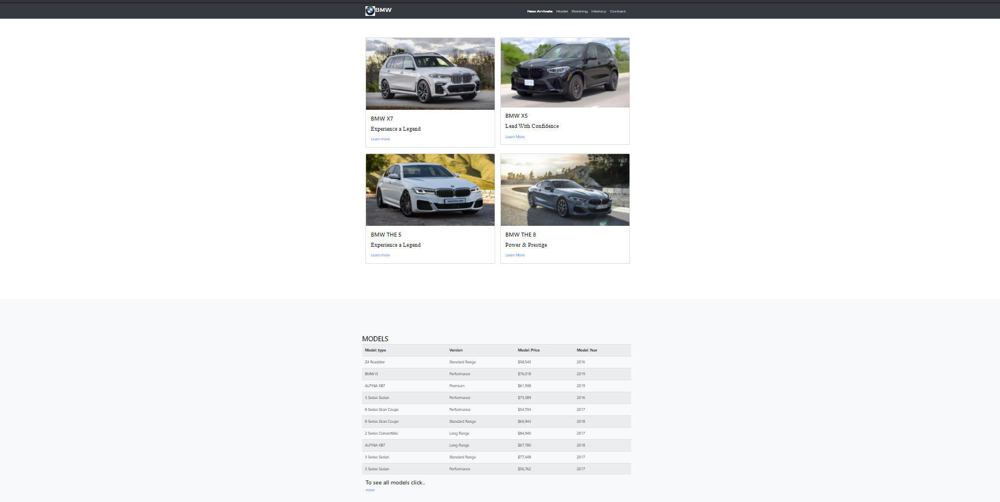
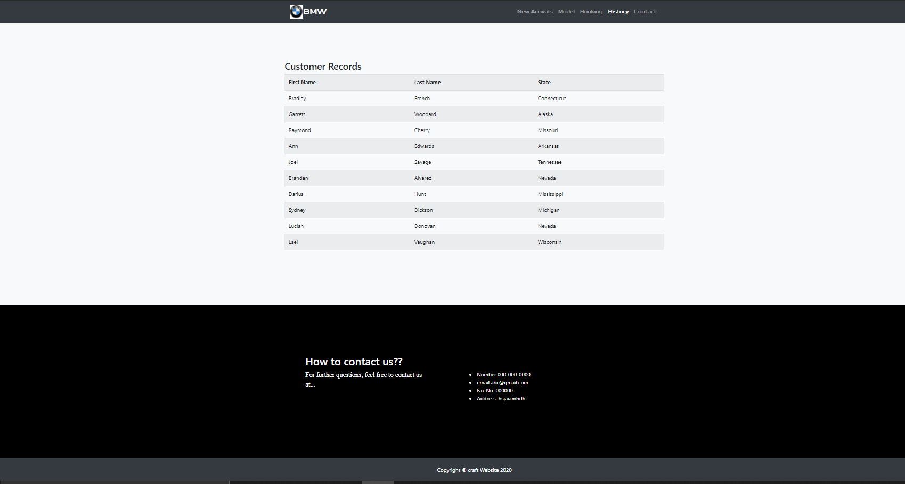

# Description

* The objective of this project is to create a database with the flexibility to process meaningful data which is essential for the company to streamline their online purchase funnel and improve customer experience. 
* The proposed database will offer quick access to the resources such as customer data and their purchase history. 
* Customer and order tracking will have a major part to play in analyzing and investigating data in order to churn out insights to improve business processes and make informed decisions.

# Tools used

* Web-Server - XAMPP
* Programming Language - PHP
* Framework - Bootstrap

# Running the app

1. Click on Clone the file and download zip.
2. Download and install XAMPP.
3. Create folder in C:\xampp\htdocs and extract files in folder.
4. Click on index1.php file.

# Screen Capture

* Following are some screen captures of website.

